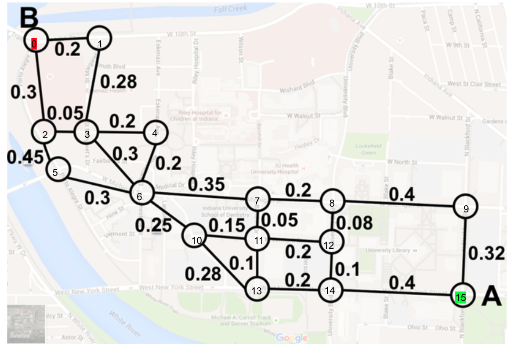
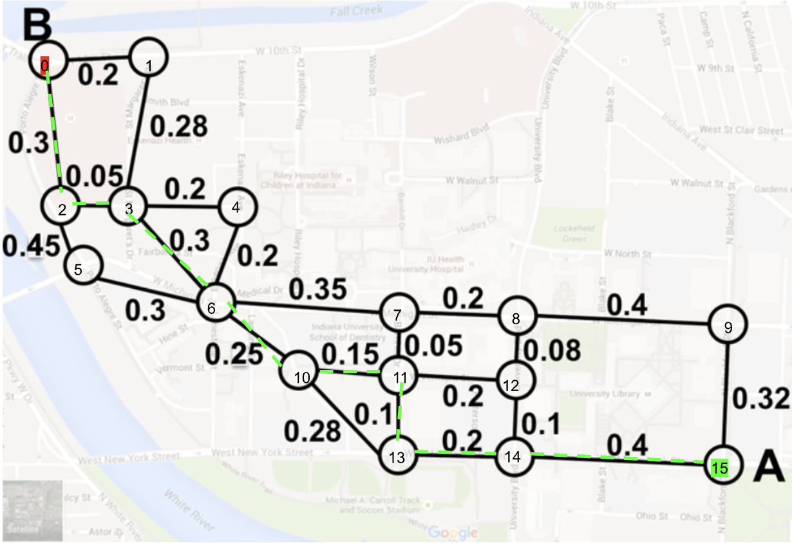

# Spell Checker
Elliot Wyrick - 11/11/25

Example application of Dijkstra's Algorithm


### To run:

- initialize CMake in build directory 
```
cmake ..
```
- run the makefile it creates
```
make
```
- run the executable with dictionary file
```
./shortest-path
```
### What It Does

- Loads graph edges from input file (`edges.txt`)
- Constructs graph with configurable number of nodes (default: 16 nodes)
- Implements Dijkstra's algorithm to find shortest path between two nodes
- Provides real-time updates during algorithm execution showing distance updates
- Outputs shortest distance and complete path from source to target
- Handles unreachable nodes gracefully


## [Demo video:](https://youtu.be/ACQbY-DoEqU)

[](https://youtu.be/ACQbY-DoEqU)

### Graph Implementation

- Uses adjacency list representation for efficient edge storage
- Each node stores a vector of outgoing edges (destination + weight)
- Supports directed weighted graphs
- Edge weights are floating-point values (double precision)

### Dijkstra's Algorithm Details

Implementation of shortest path algorithm with optimizations:
- Min-heap priority queue for efficient minimum distance extraction
- Distance vector initialized to infinity for all nodes except source (0.0)
- Parent tracking for path reconstruction
- Early termination when target node is reached
- Skips stale entries in priority queue (when better path already found)
- Relaxation step updates distances when shorter path discovered
- Real-time console output shows distance updates during execution

### Edge Cases

- Unreachable nodes: Algorithm detects and reports when no path exists
- Source equals target: Returns distance of 0.0
- Disconnected components: Correctly handles graphs with isolated nodes
- File loading errors: Graceful error handling with informative messages

## Example Usage

### Starting Node Relationships (edges.txt)


### Program Output
```
Constructing Graph with 16 nodes...
Node 0 = Start (A)
Node 15 = End (B)

--- Starting Dijkstra's Algorithm ---
  • Updated Node 1: New Distance 0.2 (via Node 0)
  • Updated Node 2: New Distance 0.3 (via Node 0)
  • Updated Node 3: New Distance 0.48 (via Node 1)
  • Updated Node 3: New Distance 0.35 (via Node 2)
  • Updated Node 5: New Distance 0.75 (via Node 2)
  • Updated Node 4: New Distance 0.55 (via Node 3)
  • Updated Node 6: New Distance 0.65 (via Node 3)
  • Updated Node 7: New Distance 1 (via Node 6)
  • Updated Node 10: New Distance 0.9 (via Node 6)
  • Updated Node 11: New Distance 1.05 (via Node 10)
  • Updated Node 13: New Distance 1.18 (via Node 10)
  • Updated Node 8: New Distance 1.2 (via Node 7)
  • Updated Node 12: New Distance 1.25 (via Node 11)
  • Updated Node 13: New Distance 1.15 (via Node 11)
  • Updated Node 14: New Distance 1.35 (via Node 13)
  • Updated Node 9: New Distance 1.6 (via Node 8)
  • Updated Node 15: New Distance 1.75 (via Node 14)

--- Results ---
Shortest Distance from Node 0 (A) to Node 15 (B): 1.75
Path: 0 -> 2 -> 3 -> 6 -> 10 -> 11 -> 13 -> 14 -> 15
```

### Determined Shortest Path


*Note: Images are for demonstration purposes only and are not generated by the program*